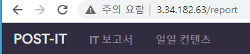
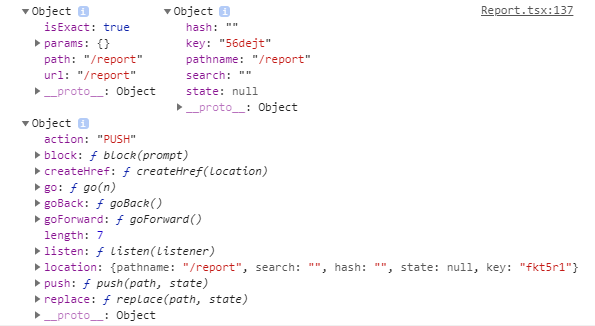
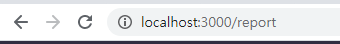
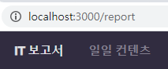

# [Router] isActive 스타일 적용하기

> ### 개발환경
>
> "react": "^17.0.1",
>
> "react-router-dom": "^5.2.0",
>
> "typescript": "^4.1.2",
>
> ### 문제
>
> 헤더에서 해당 페이지로 이동할 때, 탭을 클릭하면 스타일이 적용되게 만들고 싶었다. 
>
> 구글링을 해보니 react-router-dom 라이브러리의 NavLink 컴포넌트를 활용하면 된다기에 한 번 사용해봤다.

### 사건의 발단

현재 경로는 `/report`

하지만, 내가 보고서 탭에 있는지, 일일 컨텐츠 탭에 있는지 제대로 된 표시가 없어서 육안으로 파악하기 힘들다. ui/ux 측면에서 감점 1점 + 마음에도 안든다.



### 해결 과정

> 오늘의 목표 - Router 경로를 이동하는 탭을 클릭했을 경우 해당 탭이 활성화 돼야한다.

구글링을 하다가 좋은 코드샘플을 발견했다. 

https://www.oreilly.com/library/view/react-router-quick/9781789532555/44a5b35c-3fbd-4dec-b873-91618b17bd15.xhtml

```react
<NavLink    
  to={{pathname: '/user', search: '?id=1', hash: '#hash', state: { isAdmin: true }    }}    
  activeStyle={{ background: 'red', color: 'white' }}    
  isActive={(match, location) => {
        if (!match) {return false;
  }
  const searchParams = new URLSearchParams(location.search);
  return match.isExact && searchParams.has('id');}}
  >
  	User
</NavLink>
```

코드를 해석하면 

- match가 false이면 `isActive = false` 반환
- 아니면 `match.isExact`를 반환한다.

근데 match가 뭐지? 어디서 나온거지? 라는 궁금증에 다시 구글링 시작 

[Router: match, location, history 에 대해 너무 잘 정리된 포스트를 찾았다.](https://gongbu-ing.tistory.com/45)

요약하자면, react-router-dom은 웹 api인 `history api`에 접근하는데, 각각의 컴포넌트에 props로 match, location, history라는 객체를 전달한다.

이를 확인하기 위해 직접 결과를 console로 찍어보고 싶었다. 그래서 이전에 작업하던 컴포넌트에서 match, location, history 를 각각 받아서 출력해보도록 했다.

```react
function Report({ match, location, history }) {
  console.log(match, location, history);
...
```

위의 코드로 찍어보면 잘 출력될까 ? 아니면 오류가 날까 ?

결과는 안타깝게도 typescript에 막혀서 오류를 뿜어냈다. 타입스크립트 개발환경에서 작업중이므로, 각각의 매개변수에 대한 Type이 지정돼있지 않아서이다... 

기존의 stateless component에서 Props를 설정하는 것처럼 interface만 설정해주면 되겠지...라고 생각한 후 찾아보니 너무 잘 나와있는 포스트를 발견했다. 

[Typescipt, React 에서 match사용하기](https://wooooooak.github.io/frontend/2018/11/02/Typescript%EC%99%80-React%EC%97%90%EC%84%9C-match-%EC%82%AC%EC%9A%A9%ED%95%98%EA%B8%B0/)

포스트가 이끄는대로 코드를 변경한 후 출력해봤다. 그 결과, 각각 match, location, history에 해당하는 콘솔이 출력됐다. 이 중에서 match.isExact가 true라는 사실을 집중한다. 





현재의 url경로는 /report이고 match의 path 또한 /report이므로 match.isExact는 현재의 경로와 match의 경로가 동일하니? 를 확인해주는 변수인 것을 확인할 수 있다. 

그럼 본론으로 들어가서 match.isExact면 내가 워하는 Style을 적용시켜주면 오늘의 과제는 끝이난다.

### 코드 적용

이제 우리 코드에 적용한다.

- 타입을 먼저 지정하자
  - 우리에게 필요한 것은 `to`, `isActive`, `activeStyle` 이다. 
  - 하지만 isActive와 activeStyle은 컴포넌트에서 고정적으로 적용하면 되기때문에 타입지정이 필요없다. (match, location에 따른 조건, 스타일은 동일하게 적용하기에..)

  - 추가적으로 지정해줄 타입은 `item`, `children` 인데, 각 각 `클래스명`, `탭 이름` 이다. (class라고 지으면 됐을텐데 왜 item? 이라고 생각할 수 있는데.. 해보니 오류난다. class는 고유값이므로 선언을 못하게 막아놓은듯하다.) 

```typescript
interface MenuTypes {
  to: string;
  item: string;
  children?: string;
}
```

- 컴포넌트화

```react
const MenuItem = ({ to, item, children }: MenuTypes) => (
  <NavLink
    to={to}
    className={`header-${item}`}
    activeStyle={{ color: theme.colors.text.first }}
    isActive={(match) => {
      if (!match) {
        return false;
      }
      return match.isExact;
    }}
  >
    {children}
  </NavLink>
);
```

- 사용

```react
<MenuItem to={'/'} item={'logo'}>
    탭이름1
</MenuItem>
<MenuItem to={'/report'} item={'menus'}>
    탭이름2
</MenuItem>
<MenuItem to={'/contents'} item={'menus'}>
    탭이름3
</MenuItem>
{props.authenticated ? (
    <MenuItem to={'/myfolder'} item={'menus'}>
        탭이름4
    </MenuItem>
) : null}
```


### 결과

- 현재의 위치에 해당하는 경로에 match.isExact가 true인 경우 아래처럼 style이 잘 적용된다.
- 문제해결 완료 !



