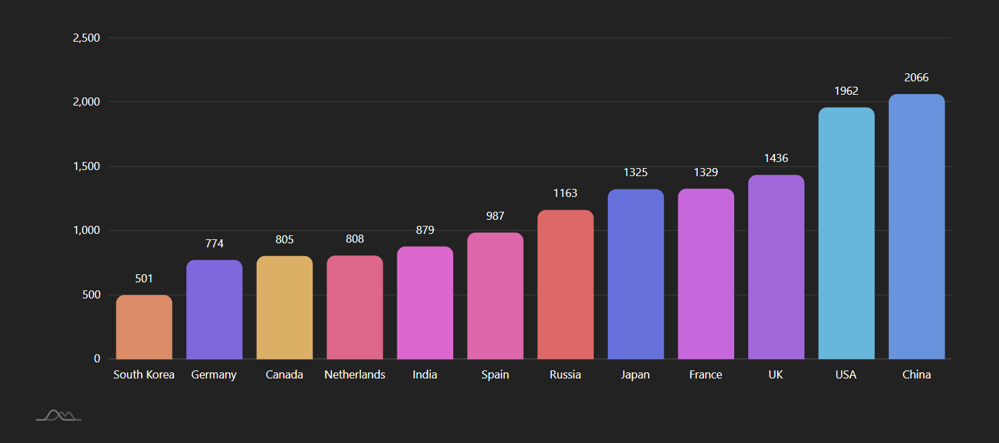
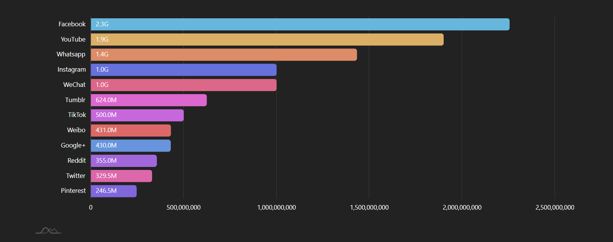
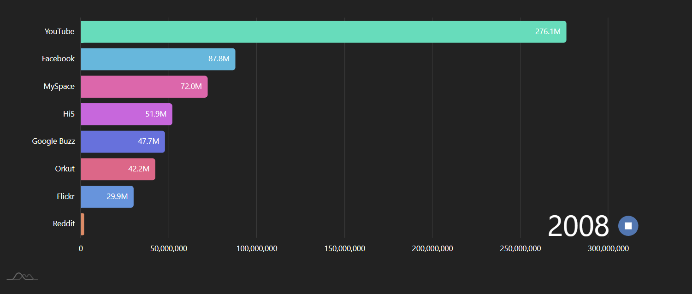
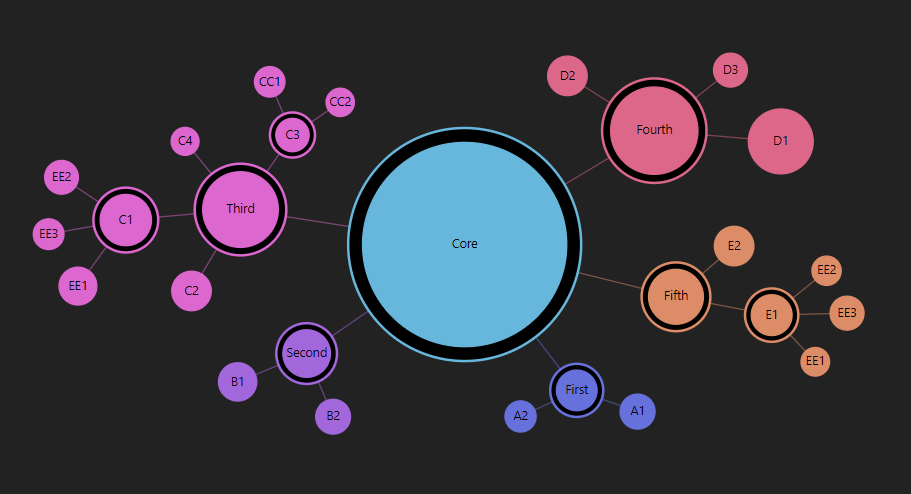
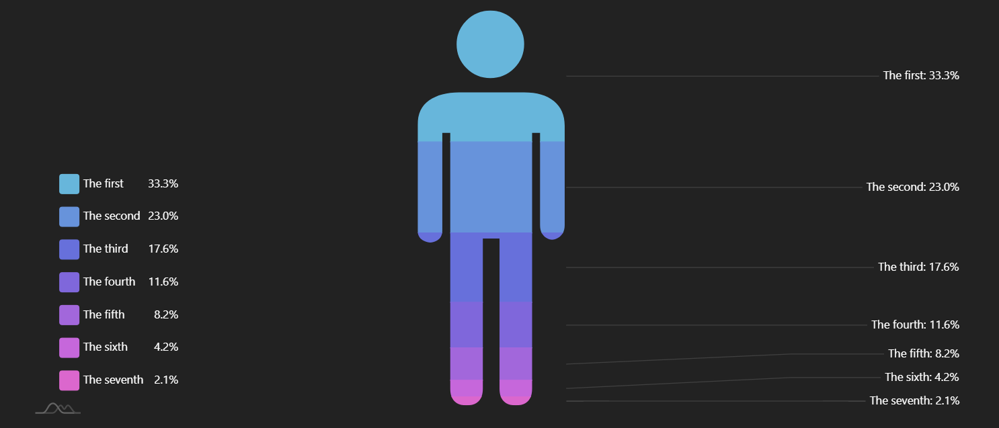

# 차트 정리

> 암차트 사용 예정 (https://www.amcharts.com/demos/)

[toc]

## 카테고리 별

### 바 그래프

- Real time data sorting



```typescript
/* Imports */
import * as am4core from "@amcharts/amcharts4/core";
import * as am4charts from "@amcharts/amcharts4/charts";
import am4themes_animated from "@amcharts/amcharts4/themes/animated";

/* Chart code */
// Themes begin
am4core.useTheme(am4themes_animated);
// Themes end

let chart = am4core.create("chartdiv", am4charts.XYChart);

chart.data = [{
 "country": "USA",
 "visits": 2025
}, {
 "country": "China",
 "visits": 1882
}, {
 "country": "Japan",
 "visits": 1809
}, {
 "country": "Germany",
 "visits": 1322
}, {
 "country": "UK",
 "visits": 1122
}, {
 "country": "France",
 "visits": 1114
}, {
 "country": "India",
 "visits": 984
}, {
 "country": "Spain",
 "visits": 711
}, {
 "country": "Netherlands",
 "visits": 665
}, {
 "country": "Russia",
 "visits": 580
}, {
 "country": "South Korea",
 "visits": 443
}, {
 "country": "Canada",
 "visits": 441
}];

chart.padding(40, 40, 40, 40);

let categoryAxis = chart.xAxes.push(new am4charts.CategoryAxis());
categoryAxis.renderer.grid.template.location = 0;
categoryAxis.dataFields.category = "country";
categoryAxis.renderer.minGridDistance = 60;
categoryAxis.renderer.inversed = true;
categoryAxis.renderer.grid.template.disabled = true;

let valueAxis = chart.yAxes.push(new am4charts.ValueAxis());
valueAxis.min = 0;
valueAxis.extraMax = 0.1;
//valueAxis.rangeChangeEasing = am4core.ease.linear;
//valueAxis.rangeChangeDuration = 1500;

let series = chart.series.push(new am4charts.ColumnSeries());
series.dataFields.categoryX = "country";
series.dataFields.valueY = "visits";
series.tooltipText = "{valueY.value}"
series.columns.template.strokeOpacity = 0;
series.columns.template.column.cornerRadiusTopRight = 10;
series.columns.template.column.cornerRadiusTopLeft = 10;
//series.interpolationDuration = 1500;
//series.interpolationEasing = am4core.ease.linear;
let labelBullet = series.bullets.push(new am4charts.LabelBullet());
labelBullet.label.verticalCenter = "bottom";
labelBullet.label.dy = -10;
labelBullet.label.text = "{values.valueY.workingValue.formatNumber('#.')}";

chart.zoomOutButton.disabled = true;

// as by default columns of the same series are of the same color, we add adapter which takes colors from chart.colors color set
series.columns.template.adapter.add("fill", function (fill, target) {
 return chart.colors.getIndex(target.dataItem.index);
});

setInterval(function () {
 am4core.array.each(chart.data, function (item) {
   item.visits += Math.round(Math.random() * 200 - 100);
   item.visits = Math.abs(item.visits);
 })
 chart.invalidateRawData();
}, 2000)

categoryAxis.sortBySeries = series;
```

- Sorted bar chart



```typescript
/* Imports */
import * as am4core from "@amcharts/amcharts4/core";
import * as am4charts from "@amcharts/amcharts4/charts";
import am4themes_animated from "@amcharts/amcharts4/themes/animated";

/* Chart code */
// Themes begin
am4core.useTheme(am4themes_animated);
// Themes end

let chart = am4core.create("chartdiv", am4charts.XYChart);
chart.padding(40, 40, 40, 40);

let categoryAxis = chart.yAxes.push(new am4charts.CategoryAxis());
categoryAxis.renderer.grid.template.location = 0;
categoryAxis.dataFields.category = "network";
categoryAxis.renderer.minGridDistance = 1;
categoryAxis.renderer.inversed = true;
categoryAxis.renderer.grid.template.disabled = true;

let valueAxis = chart.xAxes.push(new am4charts.ValueAxis());
valueAxis.min = 0;

let series = chart.series.push(new am4charts.ColumnSeries());
series.dataFields.categoryY = "network";
series.dataFields.valueX = "MAU";
series.tooltipText = "{valueX.value}"
series.columns.template.strokeOpacity = 0;
series.columns.template.column.cornerRadiusBottomRight = 5;
series.columns.template.column.cornerRadiusTopRight = 5;

let labelBullet = series.bullets.push(new am4charts.LabelBullet())
labelBullet.label.horizontalCenter = "left";
labelBullet.label.dx = 10;
labelBullet.label.text = "{values.valueX.workingValue.formatNumber('#.0as')}";
labelBullet.locationX = 1;

// as by default columns of the same series are of the same color, we add adapter which takes colors from chart.colors color set
series.columns.template.adapter.add("fill", function(fill, target){
  return chart.colors.getIndex(target.dataItem.index);
});

categoryAxis.sortBySeries = series;

// 태그 + 형태소 빈도수 기반으로
chart.data = [
    {
      "network": "Facebook",
      "MAU": 2255250000
    },
    {
      "network": "Google+",
      "MAU": 430000000
    },
    {
      "network": "Instagram",
      "MAU": 1000000000
    },
    {
      "network": "Pinterest",
      "MAU": 246500000
    },
    {
      "network": "Reddit",
      "MAU": 355000000
    },
    {
      "network": "TikTok",
      "MAU": 500000000
    },
    {
      "network": "Tumblr",
      "MAU": 624000000
    },
    {
      "network": "Twitter",
      "MAU": 329500000
    },
    {
      "network": "WeChat",
      "MAU": 1000000000
    },
    {
      "network": "Weibo",
      "MAU": 431000000
    },
    {
      "network": "Whatsapp",
      "MAU": 1433333333
    },
    {
      "network": "YouTube",
      "MAU": 1900000000
    }
  ]
```

- Bar chart race(애니메이션 있는거)
  - 코드길이 길어서 링크 겁니당 (https://www.amcharts.com/demos/bar-chart-race/)




### 워드 클라우드

- Changing data of Word cloud(애니메이션 있는거)


```typescript
/* Imports */
import * as am4core from "@amcharts/amcharts4/core";
import * as am4charts from "@amcharts/amcharts4/charts";

import am4themes_dark from "@amcharts/amcharts4/themes/dark";
import am4themes_animated from "@amcharts/amcharts4/themes/animated";

/* Chart code */
// Themes begin
am4core.useTheme(am4themes_dark);
am4core.useTheme(am4themes_animated);
// Themes end

let chart = am4core.create("chartdiv", am4plugins_wordCloud.WordCloud);
let series = chart.series.push(new am4plugins_wordCloud.WordCloudSeries());

series.accuracy = 4;
series.step = 15;
series.rotationThreshold = 0.7;
series.maxCount = 200;
series.minWordLength = 2;
series.labels.template.margin(4,4,4,4);
series.maxFontSize = am4core.percent(30);

series.text = "Though yet of Hamlet our dear brother's death The memory be green, and that it us befitted To bear our hearts in grief and our whole kingdom To be contracted in one brow of woe, Yet so far hath discretion fought with nature That we with wisest sorrow think on him, Together with remembrance of ourselves. Therefore our sometime sister, now our queen, The imperial jointress to this warlike state, Have we, as 'twere with a defeated joy,-- With an auspicious and a dropping eye, With mirth in funeral and with dirge in marriage, In equal scale weighing delight and dole,-- Taken to wife: nor have we herein barr'd Your better wisdoms, which have freely gone With this affair along. For all, our thanks. Now follows, that you know, young Fortinbras, Holding a weak supposal of our worth, Or thinking by our late dear brother's death Our state to be disjoint and out of frame, Colleagued with the dream of his advantage, He hath not fail'd to pester us with message, Importing the surrender of those lands Lost by his father, with all bonds of law, To our most valiant brother. So much for him. Now for ourself and for this time of meeting: Thus much the business is: we have here writ To Norway, uncle of young Fortinbras,-- Who, impotent and bed-rid, scarcely hears Of this his nephew's purpose,--to suppress His further gait herein; in that the levies, The lists and full proportions, are all made Out of his subject: and we here dispatch You, good Cornelius, and you, Voltimand, For bearers of this greeting to old Norway; Giving to you no further personal power To business with the king, more than the scope Of these delated articles allow. Farewell, and let your haste commend your duty. Tis sweet and commendable in your nature, Hamlet,To give these mourning duties to your father: But, you must know, your father lost a father; That father lost, lost his, and the survivor bound In filial obligation for some term To do obsequious sorrow: but to persever In obstinate condolement is a course Of impious stubbornness; 'tis unmanly grief; It shows a will most incorrect to heaven, A heart unfortified, a mind impatient, An understanding simple and unschool'd: For what we know must be and is as common As any the most vulgar thing to sense, Why should we in our peevish opposition Take it to heart? Fie! 'tis a fault to heaven, A fault against the dead, a fault to nature, To reason most absurd: whose common theme Is death of fathers, and who still hath cried, From the first corse till he that died to-day, 'This must be so.' We pray you, throw to earth This unprevailing woe, and think of us As of a father: for let the world take note, You are the most immediate to our throne; And with no less nobility of love Than that which dearest father bears his son, Do I impart toward you. For your intent In going back to school in Wittenberg, It is most retrograde to our desire: And we beseech you, bend you to remain Here, in the cheer and comfort of our eye, Our chiefest courtier, cousin, and our son."; 

series.colors = new am4core.ColorSet();
series.colors.passOptions = {}; // makes it loop

//series.labelsContainer.rotation = 45;
series.angles = [0,-90];
series.fontWeight = "700"

setInterval(function () {
  series.dataItems.getIndex(Math.round(Math.random() * (series.dataItems.length - 1))).setValue("value", Math.round(Math.random() * 10));
 }, 10000)

```

- Tag cloud (바로 스택오버플로우로 가버리게 링크 걸려있음....wow)


```typescript
/* Imports */
import * as am4core from "@amcharts/amcharts4/core";
import * as am4charts from "@amcharts/amcharts4/charts";

import am4themes_dark from "@amcharts/amcharts4/themes/dark";
import am4themes_animated from "@amcharts/amcharts4/themes/animated";

/* Chart code */
// Themes begin
am4core.useTheme(am4themes_dark);
am4core.useTheme(am4themes_animated);
// Themes end

let chart = am4core.create("chartdiv", am4plugins_wordCloud.WordCloud);
chart.fontFamily = "Courier New";
let series = chart.series.push(new am4plugins_wordCloud.WordCloudSeries());
series.randomness = 0.1;
series.rotationThreshold = 0.5;

// 태그 빈도수 기반으로(형태소 X)
series.data = [ {
    "tag": "javascript",
    "count": "1765836"
}, {
    "tag": "java",
    "count": "1517355"
}, {
    "tag": "c#",
    "count": "1287629"
}, {
    "tag": "php",
    "count": "1263946"
}, {
    "tag": "android",
    "count": "1174721"
}, {
    "tag": "python",
    "count": "1116769"
}, {
    "tag": "jquery",
    "count": "944983"
}, {
    "tag": "html",
    "count": "805679"
}, {
    "tag": "c++",
    "count": "606051"
}, {
    "tag": "ios",
    "count": "591410"
}, {
    "tag": "css",
    "count": "574684"
}, {
    "tag": "mysql",
    "count": "550916"
}, {
    "tag": "sql",
    "count": "479892"
}, {
    "tag": "asp.net",
    "count": "343092"
}, {
    "tag": "ruby-on-rails",
    "count": "303311"
}, {
    "tag": "c",
    "count": "296963"
}, {
    "tag": "arrays",
    "count": "288445"
}, {
    "tag": "objective-c",
    "count": "286823"
}, {
    "tag": ".net",
    "count": "280079"
}, {
    "tag": "r",
    "count": "277144"
}, {
    "tag": "node.js",
    "count": "263451"
}, {
    "tag": "angularjs",
    "count": "257159"
}, {
    "tag": "json",
    "count": "255661"
}, {
    "tag": "sql-server",
    "count": "253824"
}, {
    "tag": "swift",
    "count": "222387"
}, {
    "tag": "iphone",
    "count": "219827"
}, {
    "tag": "regex",
    "count": "203121"
}, {
    "tag": "ruby",
    "count": "202547"
}, {
    "tag": "ajax",
    "count": "196727"
}, {
    "tag": "django",
    "count": "191174"
}, {
    "tag": "excel",
    "count": "188787"
}, {
    "tag": "xml",
    "count": "180742"
}, {
    "tag": "asp.net-mvc",
    "count": "178291"
}, {
    "tag": "linux",
    "count": "173278"
}, {
    "tag": "angular",
    "count": "154447"
}, {
    "tag": "database",
    "count": "153581"
}, {
    "tag": "wpf",
    "count": "147538"
}, {
    "tag": "spring",
    "count": "147456"
}, {
    "tag": "wordpress",
    "count": "145801"
}, {
    "tag": "python-3.x",
    "count": "145685"
}, {
    "tag": "vba",
    "count": "139940"
}, {
    "tag": "string",
    "count": "136649"
}, {
    "tag": "xcode",
    "count": "130591"
}, {
    "tag": "windows",
    "count": "127680"
}, {
    "tag": "reactjs",
    "count": "125021"
}, {
    "tag": "vb.net",
    "count": "122559"
}, {
    "tag": "html5",
    "count": "118810"
}, {
    "tag": "eclipse",
    "count": "115802"
}, {
    "tag": "multithreading",
    "count": "113719"
}, {
    "tag": "mongodb",
    "count": "110348"
}, {
    "tag": "laravel",
    "count": "109340"
}, {
    "tag": "bash",
    "count": "108797"
}, {
    "tag": "git",
    "count": "108075"
}, {
    "tag": "oracle",
    "count": "106936"
}, {
    "tag": "pandas",
    "count": "96225"
}, {
    "tag": "postgresql",
    "count": "96027"
}, {
    "tag": "twitter-bootstrap",
    "count": "94348"
}, {
    "tag": "forms",
    "count": "92995"
}, {
    "tag": "image",
    "count": "92131"
}, {
    "tag": "macos",
    "count": "90327"
}, {
    "tag": "algorithm",
    "count": "89670"
}, {
    "tag": "python-2.7",
    "count": "88762"
}, {
    "tag": "scala",
    "count": "86971"
}, {
    "tag": "visual-studio",
    "count": "85825"
}, {
    "tag": "list",
    "count": "84392"
}, {
    "tag": "excel-vba",
    "count": "83948"
}, {
    "tag": "winforms",
    "count": "83600"
}, {
    "tag": "apache",
    "count": "83367"
}, {
    "tag": "facebook",
    "count": "83212"
}, {
    "tag": "matlab",
    "count": "82452"
}, {
    "tag": "performance",
    "count": "81443"
}, {
    "tag": "css3",
    "count": "78250"
}, {
    "tag": "entity-framework",
    "count": "78243"
}, {
    "tag": "hibernate",
    "count": "76123"
}, {
    "tag": "typescript",
    "count": "74867"
}, {
    "tag": "linq",
    "count": "73128"
}, {
    "tag": "swing",
    "count": "72333"
}, {
    "tag": "function",
    "count": "72043"
}, {
    "tag": "amazon-web-services",
    "count": "71155"
}, {
    "tag": "qt",
    "count": "69552"
}, {
    "tag": "rest",
    "count": "69138"
}, {
    "tag": "shell",
    "count": "68854"
}, {
    "tag": "azure",
    "count": "67431"
}, {
    "tag": "firebase",
    "count": "66411"
}, {
    "tag": "api",
    "count": "66158"
}, {
    "tag": "maven",
    "count": "66113"
}, {
    "tag": "powershell",
    "count": "65467"
}, {
    "tag": ".htaccess",
    "count": "65014"
}, {
    "tag": "sqlite",
    "count": "64888"
}, {
    "tag": "file",
    "count": "62783"
}, {
    "tag": "codeigniter",
    "count": "62393"
}, {
    "tag": "unit-testing",
    "count": "61909"
}, {
    "tag": "perl",
    "count": "61752"
}, {
    "tag": "loops",
    "count": "61015"
}, {
    "tag": "symfony",
    "count": "60820"
}, {
    "tag": "selenium",
    "count": "59855"
}, {
    "tag": "google-maps",
    "count": "59616"
}, {
    "tag": "csv",
    "count": "59600"
}, {
    "tag": "uitableview",
    "count": "59011"
}, {
    "tag": "web-services",
    "count": "58916"
}, {
    "tag": "cordova",
    "count": "58195"
}, {
    "tag": "class",
    "count": "58055"
}, {
    "tag": "numpy",
    "count": "57132"
}, {
    "tag": "google-chrome",
    "count": "56836"
}, {
    "tag": "ruby-on-rails-3",
    "count": "55962"
}, {
    "tag": "android-studio",
    "count": "55801"
}, {
    "tag": "tsql",
    "count": "55736"
}, {
    "tag": "validation",
    "count": "55531"
} ];

series.dataFields.word = "tag";
series.dataFields.value = "count";

series.heatRules.push({
 "target": series.labels.template,
 "property": "fill",
 "dataField": "value"
});

series.labels.template.url = "https://stackoverflow.com/questions/tagged/{word}";
series.labels.template.urlTarget = "_blank";
series.labels.template.tooltipText = "{word}: {value}";

let hoverState = series.labels.template.states.create("hover");
hoverState.properties.fill = am4core.color("#FF0000");

let subtitle = chart.titles.create();
subtitle.text = "(click to open)";

let title = chart.titles.create();
title.text = "Most Popular Tags @ StackOverflow";
title.fontSize = 20;
title.fontWeight = "800";
```

### 네트워크맵

- Force-directed tree



```typescript
/* Imports */
import * as am4core from "@amcharts/amcharts4/core";
import * as am4charts from "@amcharts/amcharts4/charts";

import am4themes_dark from "@amcharts/amcharts4/themes/dark";
import am4themes_animated from "@amcharts/amcharts4/themes/animated";

/* Chart code */
// Themes begin
am4core.useTheme(am4themes_dark);
am4core.useTheme(am4themes_animated);
// Themes end


let chart = am4core.create("chartdiv", am4plugins_forceDirected.ForceDirectedTree);
let networkSeries = chart.series.push(new am4plugins_forceDirected.ForceDirectedSeries())

chart.data = [
  {
    name: "카테고리",
    children: [
      {
        name: "카테고리_태그", // 카테고리 8~10개
        children: [
          // 형태소 3~5개
          { name: "태그_형태소_top1", value: 100 },
          { name: "태그_형태소_top2", value: 60 }
          { name: "태그_형태소_top3", value: 40 }
        ]
      },
      {
        name: "Second",
        children: [
          { name: "B1", value: 135 },
          { name: "B2", value: 98 }
        ]
      },
      {
        name: "Third",
        children: [
          {
            name: "C1",
            children: [
              { name: "EE1", value: 130 },
              { name: "EE2", value: 87 },
              { name: "EE3", value: 55 }
            ]
          },
          { name: "C2", value: 148 },
          {
            name: "C3", children: [
              { name: "CC1", value: 53 },
              { name: "CC2", value: 30 }
            ]
          },
          { name: "C4", value: 26 }
        ]
      },
      {
        name: "Fourth",
        children: [
          { name: "D1", value: 415 },
          { name: "D2", value: 148 },
          { name: "D3", value: 89 }
        ]
      },
      {
        name: "Fifth",
        children: [
          {
            name: "E1",
            children: [
              { name: "EE1", value: 33 },
              { name: "EE2", value: 40 },
              { name: "EE3", value: 89 }
            ]
          },
          {
            name: "E2",
            value: 148
          }
        ]
      }

    ]
  }
];

networkSeries.dataFields.value = "value";
networkSeries.dataFields.name = "name";
networkSeries.dataFields.children = "children";
networkSeries.nodes.template.tooltipText = "{name}:{value}";
networkSeries.nodes.template.fillOpacity = 1;

networkSeries.nodes.template.label.text = "{name}"
networkSeries.fontSize = 10;

networkSeries.links.template.strokeWidth = 1;

let hoverState = networkSeries.links.template.states.create("hover");
hoverState.properties.strokeWidth = 3;
hoverState.properties.strokeOpacity = 1;

networkSeries.nodes.template.events.on("over", function(event) {
  event.target.dataItem.childLinks.each(function(link) {
    link.isHover = true;
  })
  if (event.target.dataItem.parentLink) {
    event.target.dataItem.parentLink.isHover = true;
  }

})

networkSeries.nodes.template.events.on("out", function(event) {
  event.target.dataItem.childLinks.each(function(link) {
    link.isHover = false;
  })
  if (event.target.dataItem.parentLink) {
    event.target.dataItem.parentLink.isHover = false;
  }
})
```

## 공통보고서

### 카테고리 별 비율

- Pictorial Stacked Chart
  - 이미지를 변경할 수 있으면, 개발자를 뜻하는 이모티콘 모양으로 그래프를 제작
  - 기존의 데이터를 활용하면 더욱 다채로운 즐거움을 선사할 수 있을듯
  - 공통보고서(모든 카테고리별 비율)



```typescript
/* Imports */
import * as am4core from "@amcharts/amcharts4/core";
import * as am4charts from "@amcharts/amcharts4/charts";
import am4themes_dark from "@amcharts/amcharts4/themes/dark";
import am4themes_animated from "@amcharts/amcharts4/themes/animated";

/* Chart code */
// Themes begin
am4core.useTheme(am4themes_dark);
am4core.useTheme(am4themes_animated);
// Themes end

let iconPath = "M53.5,476c0,14,6.833,21,20.5,21s20.5-7,20.5-21V287h21v189c0,14,6.834,21,20.5,21 c13.667,0,20.5-7,20.5-21V154h10v116c0,7.334,2.5,12.667,7.5,16s10.167,3.333,15.5,0s8-8.667,8-16V145c0-13.334-4.5-23.667-13.5-31 s-21.5-11-37.5-11h-82c-15.333,0-27.833,3.333-37.5,10s-14.5,17-14.5,31v133c0,6,2.667,10.333,8,13s10.5,2.667,15.5,0s7.5-7,7.5-13 V154h10V476 M61.5,42.5c0,11.667,4.167,21.667,12.5,30S92.333,85,104,85s21.667-4.167,30-12.5S146.5,54,146.5,42 c0-11.335-4.167-21.168-12.5-29.5C125.667,4.167,115.667,0,104,0S82.333,4.167,74,12.5S61.5,30.833,61.5,42.5z"


let chart = am4core.create("chartdiv", am4charts.SlicedChart);
chart.hiddenState.properties.opacity = 0; // this makes initial fade in effect

chart.data = [{
    "name": "The first",
    "value": 354
}, {
    "name": "The second",
    "value": 245
}, {
    "name": "The third",
    "value": 187
}, {
    "name": "The fourth",
    "value": 123
}, {
    "name": "The fifth",
    "value": 87
}, {
    "name": "The sixth",
    "value": 45
}, {
    "name": "The seventh",
    "value": 23
}];

let series = chart.series.push(new am4charts.PictorialStackedSeries());
series.dataFields.value = "value";
series.dataFields.category = "name";
series.alignLabels = true;

series.maskSprite.path = iconPath;
series.ticks.template.locationX = 1;
series.ticks.template.locationY = 0.5;

series.labelsContainer.width = 200;

chart.legend = new am4charts.Legend();
chart.legend.position = "left";
chart.legend.valign = "bottom";
```

### 최다 VOTE글 3개

> 올림픽 금, 은, 동

### 요즘 뜨는 OS / 에디터

> 바 그래프