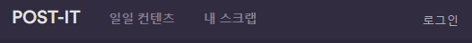
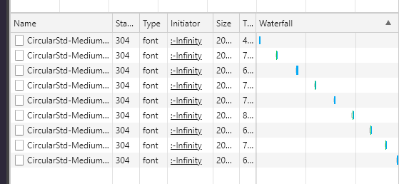
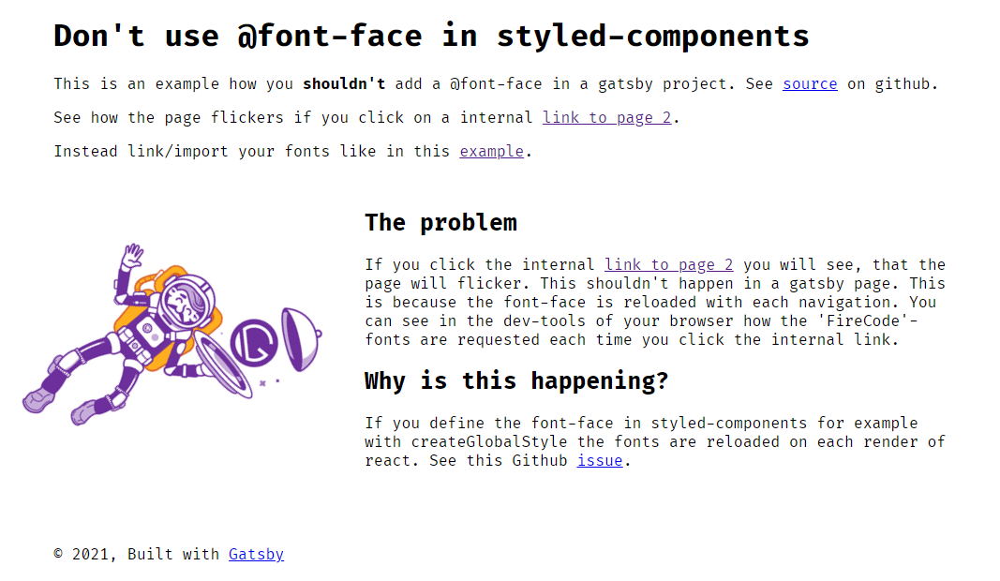
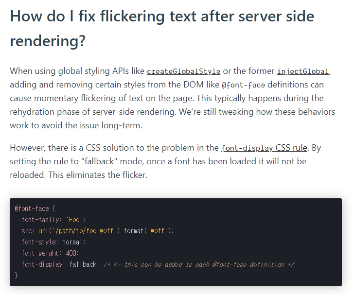

# RCA Font Reloding

> 개발환경
>
> Framwork : React
>
> Language: Typescript
>
> UI : styled-components

[toc]

### 사건



- 유일하게 내 스크랩 Link를 클릭할때 화면 깜빡임 문제 발생했다. 버튼을 누를 때마다 화면일 울그락 불그락하는데, 이는 유저입장에서 눈살이 찌푸려질 큰 사건이 아닐 수 없다.
- 구글링을 해보니 많은 단서들이 나왔다.

### 추정 원인

- FOUC(Flash Of Unstyled Content)
  - CSS가 입혀지기 전의 상태가 먼저 나타난 후, 스타일이 적용되는 현상이라고하는데
  - 해결법은 head태그 안에 스타일을 작성하는 방법이라고 한다. 하지만 더 찾아보니 실제 원인을 깨달았는데...

### 실제 원인



- 네트워크 탭을 눌러 확인해보니 `내 스크랩` 탭을 누를 때마다 폰트가 계속 추가되는 것을 확인했다. 구글링을 해보니 다음과 같은 글 발견

### 해결 과정



- 제목부터 심상찮다. `@font-face를 styled-components에서 사용하지 마세요 !`
- 우선 내 코드를 보면 `createGlobalStyle` 에 `@font-face`를 적용했다.
- createGlobalStyle은 리액트의 각 랜더링마다 재랜더링되기 때문에 위의 **원인**처럼 정적 파일(font)가 추가되는 것이다. 그럼 어째야하나?

```typescript
import { createGlobalStyle } from 'styled-components';

import NotoSansKR from './NotoSansKR-Bold.otf';
import NotoSansKR2 from './NotoSansKR-Medium.otf';
import OpenSans from './OpenSans.ttf';
import OpenSans2 from './OpenSans.woff2';
import CircularStd from './CircularStd-Medium.woff2';
import CircularStd2 from './CircularStd-Medium.woff';
import CircularStd3 from './CircularStd-Medium.ttf';

export default createGlobalStyle`
    @font-face {
        font-family: 'Noto Sans KR';
        src: local('Noto Sans KR Medium'), local('Noto Sans KR Bold'),
        url(${NotoSansKR}) format('otf'),
        url(${NotoSansKR2}) format('otf');
        font-weight: 400;
        font-style: normal;
    }
    @font-face {
        font-family: 'OpenSans';
        src: local('OpenSans'),
        url(${OpenSans}) format('ttf'),
        url(${OpenSans2}) format('woff2');
        font-weight: 400;
        font-style: normal;
    }
    @font-face {
    font-family: 'Circular Std';
    src: local('Circular Std Medium'), local('Circular-Std-Medium'),
        url(${CircularStd}) format('woff2'),
        url(${CircularStd2}) format('woff'),
        url(${CircularStd3}) format('truetype');
    font-weight: 500;
    font-style: normal;

}
`;
```

- styled-component에 해당 이슈에 대한 답이 있지않을까 하고 들어가봤다.
- 아래와 같이 `font-display: fallback` 을 추가해주면 리로드되지 않고 한번만 로드된다고한다.
- 하지만, 저 방법을 사용했는데도 해결을 하지 못했다.



### 결국

- styled-components 깃헙 이슈 목록을 확인해보니 나와 비슷한 처지의 사람들이 보였다. 그리고 라이브러리 개발자로 보이는 사람(거의 모든 이슈에 답변을 다는걸로보아..)의 답변은 다음과 같다. `그냥 @import 쓰시는편이..` 하..
- 2년 전의 내용인데도 아직 문제가 있는 사람들을 보니 아직도 문제가 해결되지 않은모양이다 ㅠㅠ.

