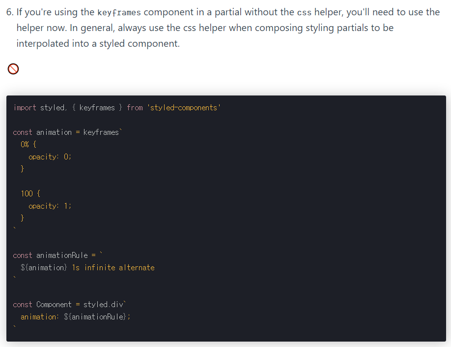
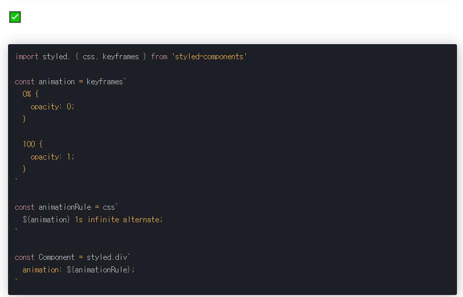

# styled-components에서 keyframe 애니메이션 사용하기

- 아래와 같은 코드도 keyframes애니메이션이 잘 동작합니다.
- 하지만, styled-components 홈페이지에는 이렇게 사용하는 것을 금지하고있는데,

```react
import styled, { keyframes } from 'styled-components'

const animation = keyframes`
  0% {
    opacity: 0;
  }

  100 {
    opacity: 1;
  }
`

const animationRule = `
  ${animation} 1s infinite alternate
`

const Component = styled.div`
  animation: ${animationRule};
`
```

- 본문을 읽어보면 `css` 헬퍼를 함께 써야한다고 쓰여있습니다. (공식문서가 하라는대로 해야지..)
- 즉 아래의 코드를 css 헬퍼로 다시 한 번 감싸서 사용해야한다고 합니다.





- 내 코드

```react
// styled-components에서 keyframe 애니메이션을 적용
const fadeIn = keyframes`
  0% {
    opacity: 0
  }
  100% {
    opacity: 1
  }
`;

const fadeInRule = css`
  ${fadeIn} 0.2s;
`;

const BackGround = styled.div`
  top: 0;
  left: 0;
  width: 100%;
  height: 100%;
  background-color: rgba(0, 0, 0, 0.3);
  position: fixed;
  display: flex;
  justify-content: center;
  align-items: center;
  animation: ${fadeInRule};
`;
```

- 결과 - good!

