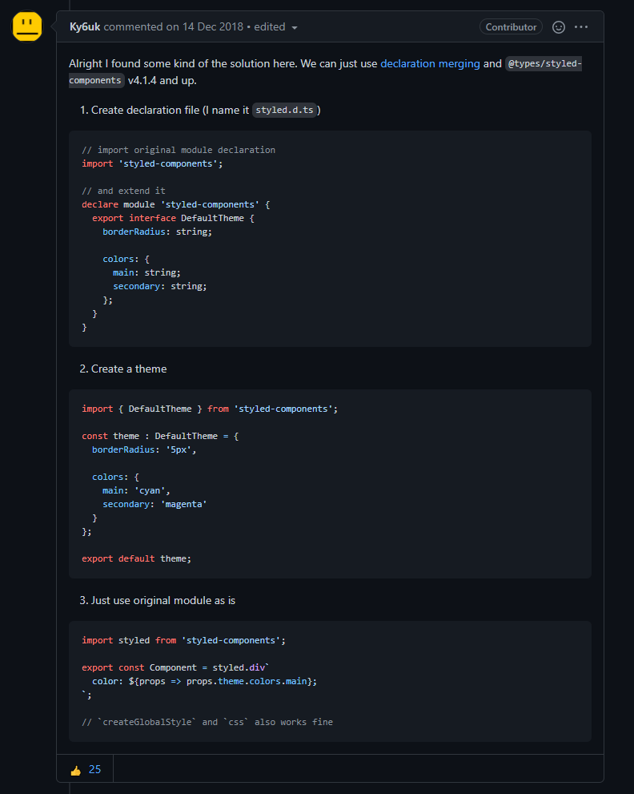

# typescript RCA에 테마 적용하기

[toc]


### Q. typescript RCA에 전체 테마(css) 속성을 적용하고 싶은데 어떻게 해야하나요?

> 아래의 내용을 참고했어요.



### A) typescript가 해당 테마의 type을 알아들을 수 있도록 declare(선언)해야 합니다.

- assets/theme/index.ts
  - `theme`에 아래처럼 많은 속성 값들이 존재합니다.
  - 예로,`fontSizes`에는 sm,md,lg `colors`에는 first, second 등이 있습니다.
  - 이에 해당하는 type값이 현재 선언이 안돼있어서 오류가나게 됩니다.

```typescript
import { DefaultTheme } from 'styled-components';

const calcRem = (size: number) => `${size / 16}rem`;

const fontSizes = {
  xs: calcRem(12),
  sm: calcRem(14),
  base: calcRem(16),
  md: calcRem(18),
  lg: calcRem(20),
  xl: calcRem(24),
  xxl: calcRem(32),
  title: calcRem(40),
};

const colors = {
  first: '#2d2839',
  second: '#312c40',
  green: '#4dcb99',
  text: {
    first: '#e2e3e6',
    second: '#acabb4',
    third: '#858090',
  },
  card: {
    title: '#f3f3f3',
    content: '#b6b7b8',
    tag: '#6A59A3',
  },
};
const gradient = {
  main: 'linear-gradient(45deg, #804bd8, #544ad8)',
};

const theme: DefaultTheme = {
  fontSizes,
  colors,
  gradient,
};

export default theme;

```

- src폴더에 `styled.d.ts` 파일 생성
  - styled-components 라이브러리의 기본 테마를 적용하기 위해 타입을 선언합니다.

```typescript
import 'styled-components';

declare module 'styled-components' {
  export interface DefaultTheme {
    fontSizes: {
      xs: string;
      sm: string;
      base: string;
      md: string;
      lg: string;
      xl: string;
      xxl: string;
      title: string;
    };
    colors: {
      first: string;
      second: string;
      green: string;
      text: {
        first: string;
        second: string;
        third: string;
      };
      card: {
        title: string;
        content: string;
        tag: string;
      };
    };
    gradient: {
      main: string;
    };
  }
}

```

### 결과

- 이제 GlobalStyle에서도 props를 사용하여 속성을 적용할 수 있어요.

```typescript
const GlobalStyle = createGlobalStyle`
    ${reset};
    * {   
        box-sizing: border-box;
        margin: 0;
        color: ${({ theme }) => theme.colors.text.second};
        padding: 0;
    }
```
